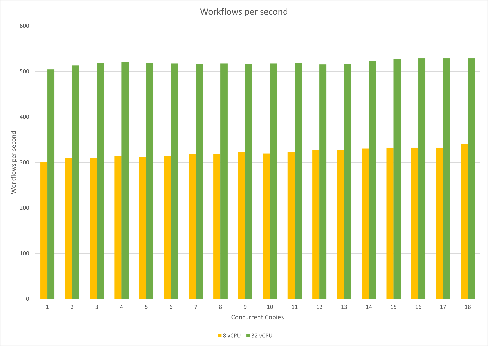
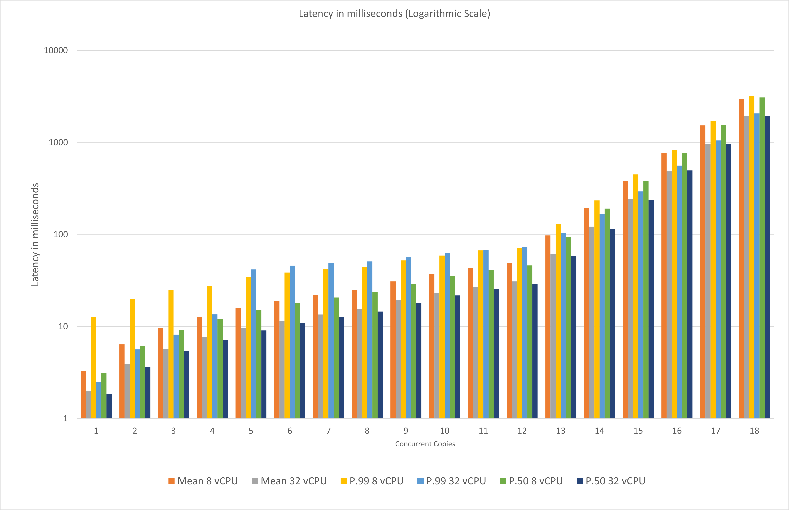

# Performance Test

Workflow-core version 3.7.0 was put under test to evaluate its performance. The setup used was single node with the default MemoryPersistenceProvider persistence provider.

## Methodology

- Test Environment - Test were run on following two environments one after the other to see how workflow-core performance with a lower vs higher hardware configuration.
  - Lower configuration
    - Cores: 8 vCPU ([Standard_D8s_v3](https://learn.microsoft.com/azure/virtual-machines/dv3-dsv3-series))
    - RAM: 32 GB
    - OS: Linux Ubuntu 20.04
    - dotNet 6
  - Higher configuration
    - Cores: 32 vCPU ([Standard_D32as_v4](https://learn.microsoft.com/azure/virtual-machines/dav4-dasv4-series))
    - RAM: 128 GB
    - OS: Linux Ubuntu 20.04
    - dotNet 6
- Test Workflow: Workflow consist of 3 basic steps. These 3 simple steps were chosen to test the performance of the workflow engine with minimal yet sufficient complexity and to avoid any external dependencies.
  - Step1 : Generate a [random number](https://learn.microsoft.com/dotnet/api/system.random?view=net-6.0) between 1 to 10 and print it on standard output.
  - Step2 :  [Conditional step](https://github.com/danielgerlag/workflow-core/blob/master/docs/control-structures.md)
    - Step 2.1: If value generate in step1 is > 5 then print it on standard output.
    - Step 2.2: If value generate in step1 is <= 5 then print it on standard output.
  - Step3: Prints a good bye message on standard output.
- Test tools:
  - [NBomber](https://nbomber.com/docs/getting-started/overview/) was used as performance testing framework with C# console app as base.

- Test scenarios:
  - Each type of test run executed for 20 minutes.
  - NBomber Load Simulation of type [KeepConstant](https://nbomber.com/docs/using-nbomber/basic-api/load-simulation#keep-constant) copies was used. This type of simulation keep a constant amount of Scenario copies(instances) for a specific period.
  - Concurrent copies [1,2,3,4,5,6,7,8,10,12,14,16,32,64,128,256,512,1024] were tested.
    - For example if we take Concurrent copies=4 and Duration=20 minutes this means that NBomber will ensure that we have 4 instance of Test Workflow running in parallel for 20 minutes.

## Results

- Workflow per seconds - Below tables shows how many workflows we are able to execute per second on two different environment with increasing number of concurrent copies.

| **Concurrent Copies** | **8 vCPU** | **32 vCPU** |
| :-------------------: | :--------: | :---------: |
|         **1**         |   300.6    |    504.7    |
|         **2**         |   310.3    |    513.1    |
|         **3**         |   309.6    |    519.3    |
|         **4**         |   314.7    |    521.3    |
|         **5**         |   312.4    |    519.0    |
|         **6**         |   314.7    |    517.7    |
|         **7**         |   318.9    |    516.7    |
|         **8**         |   318.4    |    517.5    |
|        **10**         |   322.6    |    517.1    |
|        **12**         |   319.7    |    517.6    |
|        **14**         |   322.4    |    518.1    |
|        **16**         |   327.0    |    515.5    |
|        **32**         |   327.7    |    515.8    |
|        **64**         |   330.7    |    523.7    |
|        **128**        |   332.8    |    526.9    |
|        **256**        |   332.8    |    529.1    |
|        **512**        |   332.8    |    529.1    |
|       **1024**        |   341.3    |    529.1    |

- Latency - Shows Mean, P99 and P50 latency in milliseconds on two different environment with increasing number of concurrent copies.

| **Concurrent Copies** | **Mean 8 vCPU** | **Mean 32 vCPU** | **P.99 8 vCPU** | **P.99 32 vCPU** | **P.50 8 vCPU** | **P.50 32 vCPU** |
| :-------------------: | :-------------: | :--------------: | :-------------: | :--------------: | :-------------: | :--------------: |
|         **1**         |      3.32       |       1.98       |      12.67      |       2.49       |      3.13       |       1.85       |
|         **2**         |      6.43       |       3.89       |      19.96      |       5.67       |      6.17       |       3.65       |
|         **3**         |      9.67       |       5.77       |      24.96      |       8.2        |      9.14       |       5.46       |
|         **4**         |      12.7       |       7.76       |      27.44      |      13.57       |      12.02      |       7.22       |
|         **5**         |      15.99      |       9.63       |      34.59      |      41.89       |      15.14      |       9.08       |
|         **6**         |      19.05      |      11.58       |      38.69      |      45.92       |      18.02      |      10.93       |
|         **7**         |      21.94      |      13.54       |      42.18      |       48.9       |      20.72      |      12.66       |
|         **8**         |      25.11      |      15.45       |      44.35      |      51.04       |      23.92      |      14.54       |
|        **10**         |      30.98      |      19.33       |      52.29      |      56.64       |      29.31      |      18.21       |
|        **12**         |      37.52      |      23.18       |      59.2       |      63.33       |      35.42      |      21.82       |
|        **14**         |      43.44      |      27.01       |      67.33      |      67.58       |      41.28      |      25.55       |
|        **16**         |      48.93      |      31.03       |      72.06      |      72.77       |      46.11      |      28.93       |
|        **32**         |      97.65      |      62.03       |     130.05      |      104.96      |      94.91      |      58.02       |
|        **64**         |     193.53      |      122.24      |     235.14      |      168.45      |     191.49      |      115.26      |
|        **128**        |     384.63      |      243.74      |     449.79      |      294.65      |     379.65      |      236.67      |
|        **256**        |     769.13      |      486.82      |     834.07      |      561.66      |     766.46      |      498.22      |
|        **512**        |     1538.29     |      968.02      |     1725.44     |     1052.67      |     1542.14     |      962.05      |
|       **1024**        |     2999.36     |     1935.32      |     3219.46     |     2072.57      |     3086.34     |     1935.36      |

## References

- [NBomber](https://nbomber.com/docs/getting-started/overview/)
